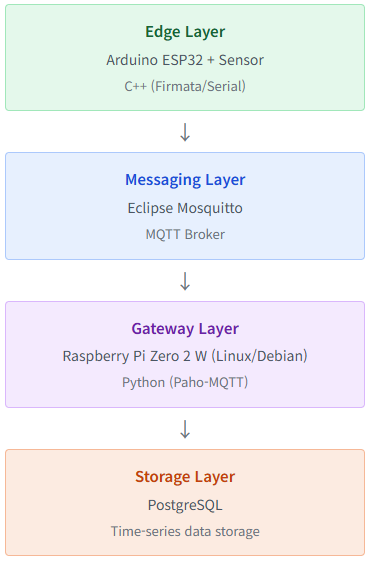
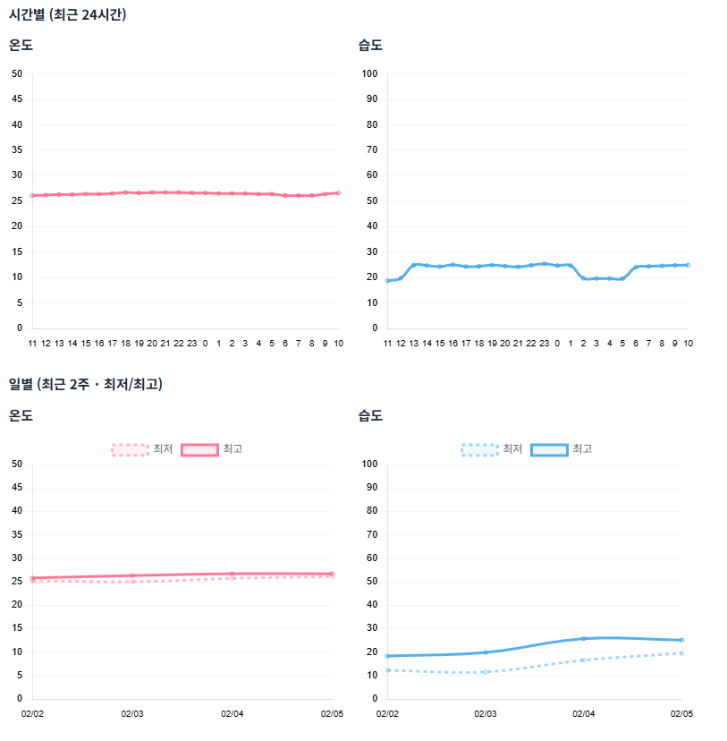

# ESP32_MQTT
아두이노를 활용한 센서 데이터 수집 및 MQTT Pub/Sub 메시징 처리

1. 개요
     • 목적: 하드웨어 센서 인터페이스 제어 및 경량 프로토콜(MQTT)을 활용한 시계열 데이터 적재 시스템의 End-to-End 프로세스 검증
     • 주요 기능: 
         &nbsp;&nbsp;&nbsp;&nbsp;- 아두이노를 활용한 센서 데이터 수집 및 시리얼 통신 전송
         &nbsp;&nbsp;&nbsp;&nbsp;- 라즈베리파이 기반 게이트웨이 구축 및 MQTT Pub/Sub 메시징 처리
         &nbsp;&nbsp;&nbsp;&nbsp;- Python 스크립트를 활용한 데이터 파싱 및 PostgreSQL 데이터베이스 적재
 
 
2. 시스템 아키텍처
 

 
 
3. 주요 구현 내용
 3.1. 센서 노드 및 데이터 전송 (Firmware)
     &nbsp;&nbsp;&nbsp;&nbsp;• DHT22 센서를 활용하여 온습도 데이터 수집.
     &nbsp;&nbsp;&nbsp;&nbsp;• 특이사항: 센서 특성을 고려하여 2초 이상의 읽기 주기를 보장.

3.2. 메시지 브로커 및 데이터 파이프라인 (Python)
     &nbsp;&nbsp;&nbsp;&nbsp;• MQTT Protocol: 저전력/저대역폭 환경에 최적화된 MQTT 프로토콜을 채택하여 게이트웨이-서버 간 통신 효율 증대.
     &nbsp;&nbsp;&nbsp;&nbsp;• Data Processing: Python의 paho-mqtt 라이브러리를 활용해 비동기식 데이터 수신.
     &nbsp;&nbsp;&nbsp;&nbsp;• 특이사항: 백그라운드에서 수신 모듈을 실행하되 중복실행 제한.
 3.3. 데이터베이스 적재 (Database)
     &nbsp;&nbsp;&nbsp;&nbsp;• 스케줄링 로직을 통해 시계열 데이터 적재.
  
4. 실행결과
 

